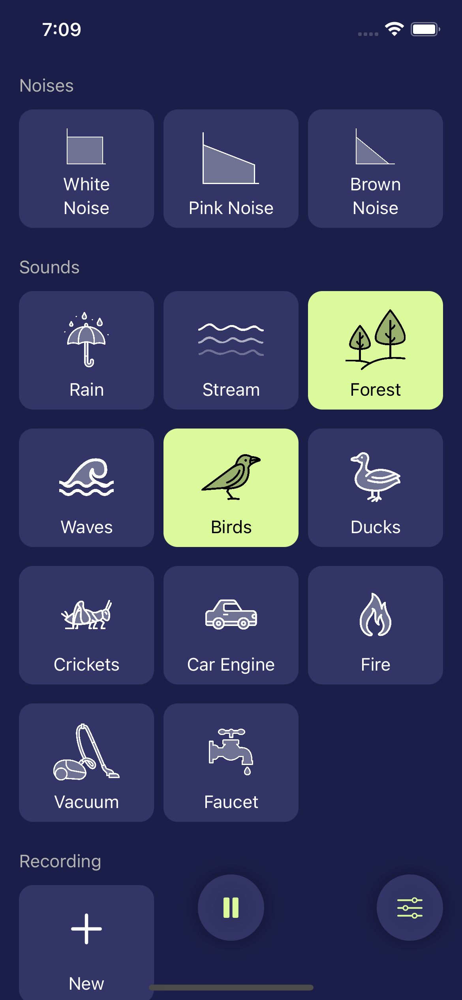

# Bruit Blanc

I built this app for my newborn. They often used to be upset and cry even tho they just ate. Cuddling with them wouldn't reassure them. So I started to search for things to help them and found studies claiming that white noise helps babies to fell asleep[1][2].

So I quickly generated some white noise, fleshed out a small app to loop that noise. It worked!

But I found white noise to be a bit too aggresive so I studied other types of "colored" noises. Found the "pink" noise which sounds a lot more "natural". And I started adding more sounds and noises to the app.

Now, when Baby is too upset and cries without consolation, I opened the app, select "Pink Noise" and "Waves", and bam - 10s later Baby is calm. It's like magic.

I can't promise you that it will work for every baby but it's worth a try?

There are also a couple of additional features:

- Record your own sound and add it to the mix
- The birds are too louds? Control the volume of each sounds independently
- Start a _decrescendo_ to lower the volume over a time

[1]: https://www.ncbi.nlm.nih.gov/pmc/articles/PMC1792397/
[2]: https://pubmed.ncbi.nlm.nih.gov/28618052/
